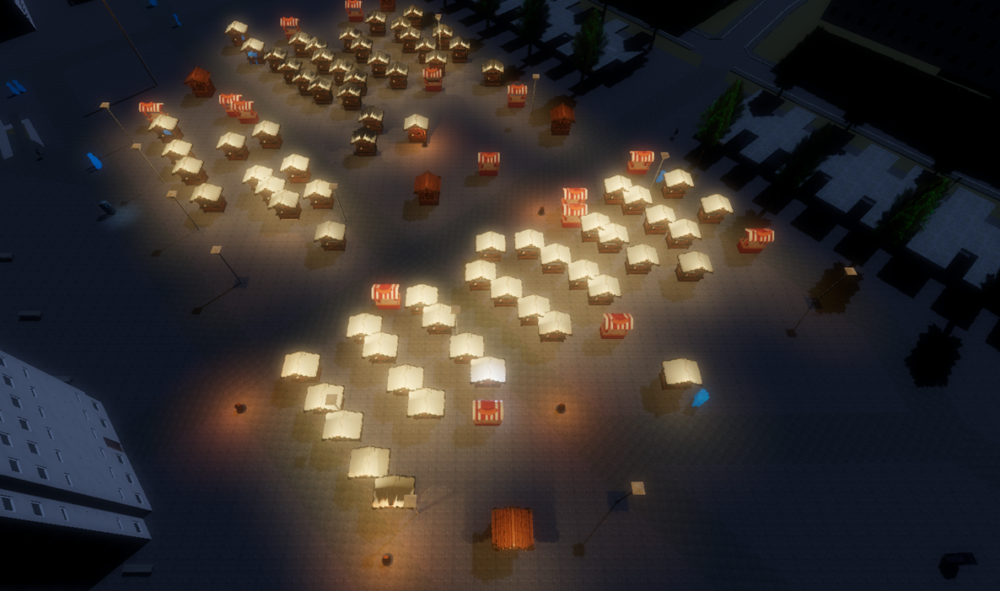

# SOH Anomaly Visualizer

The **SOH Anomaly Visualizer** is a high-performance 3D visualization tool built with **Godot 4.3** and **C#**. It is designed to visualize large-scale agent-based simulations (specifically from the SMART Open Hamburg / SOH framework) in real-time.

The application connects to a PostgreSQL database to fetch simulation "ticks," rendering thousands of agents simultaneously while providing interactive tooltips, night-time lighting effects, and accurate geospatial alignment.

This visualizer is specifically configured to work with the **SOHAnomalyBox** simulation from the [model-soh repository](https://github.com/MARS-Group-HAW/model-soh). Once the simulation is executed, this tool can be used to visualize the generated data.

## Key Features

- **Real-time 3D Playback:** Visualization of agent movements based on simulation ticks stored in PostgreSQL.
- **Geospatial Accuracy:** Every 3D unit corresponds to 1 meter in the real world (Hamburg Rathausmarkt), calibrated via MapZoom and GPS coordinates.
- **Night-time Simulation:** Environment lighting with "Moonlight," glow effects, and dynamic point lights for market stalls and street lamps.
- **Interactive Information:** Click on agents or stalls to see real-time status attributes (Hunger, Thirst, Budget, etc.).
- **Dynamic 3D Cityscape:** Integration of OpenStreetMap (OSM) data converted to 3D via [OSM2World](https://www.osm2world.org/).

## Assets and Modeling

- **Rathausmarkt Environment:** The 3D buildings and street layouts were generated using OpenStreetMap (OSM) data and processed through [OSM2World](https://www.osm2world.org/) for accurate scale and placement.
- **Christmas Market Stalls:** The various stall models (Food, Wine, ATM, etc.) are AI-generated assets.
- **Character Models:** The male and female agent models are AI-generated.

## Performance Optimizations

To handle thousands of agents and large datasets without dropping frames, several advanced optimizations were implemented:

### 1. MultiMeshInstancing (GPU-Accelerated Rendering)
Instead of creating thousands of individual `Node3D` or `MeshInstance3D` nodes (which would cause massive draw call overhead), the project uses **MultiMeshInstance3D**. 
- Instances are managed as a single draw call on the GPU.
- Agent positions and orientations are updated directly in an array, allowing the engine to render thousands of characters with minimal CPU impact.

### 2. Database Indexing
Querying a table with tens of thousands of rows for every tick can be a bottleneck.
- The system automatically checks and creates a B-tree index on the `tick` column: `CREATE INDEX IF NOT EXISTS idx_trvlr_tick ON ... (tick);`.
- This reduces query time from several seconds to milliseconds, enabling smooth "Play" functionality.

### 3. Jolt Physics Engine
The project utilizes the **Jolt Physics** engine instead of the default Godot Physics. 
- Jolt is significantly faster and more stable for 3D simulations, providing better performance for collision checks and object interaction.

### 4. Efficient Material Management
- **Material Darkening:** Building and street materials are processed recursively to ensure they react correctly to the custom night-time environment light without unnatural "auto-glow."
- **Light Culling:** Dynamic lights are added strategically to stalls and lamps with optimized ranges to avoid excessive shadow calculations.

### 5. Asset Splitting
The large city model was split into smaller, logical parts (Streets, Main Buildings, Background, and Outdoor/Props).
- This prevents the Godot Editor from crashing during import due to high memory usage.
- It allows for more efficient light-searching, as the system only needs to scan the "Outdoor Area" for lanterns instead of the entire city.

## Tech Stack

- **Game Engine:** Godot 4.3 (Forward+ Renderer)
- **Language:** C# (dotnet 8.0)
- **Database:** PostgreSQL (via Npgsql)
- **Physics:** Jolt Physics
- **Assets:** GLB/OBJ (processed via Blender & OSM2World)

## Setup and Requirements

Regardless of whether you run the project via the editor or as an executable, the following steps are required:

1.  **Git LFS:** This project uses [Git Large File Storage (LFS)](https://git-lfs.com/) to manage large 3D assets (`.glb`, `.jpg`). Ensure you have Git LFS installed before cloning or downloading the project.
2.  **Database Instance:** Ensure you have a **PostgreSQL** instance running with the simulation data. 
    > [!TIP]
    > The [SOHAnomalyBox](https://github.com/MARS-Group-HAW/model-soh) repository includes a `docker-compose` file that can be used to start a pre-configured database correctly.
2.  **Configuration:** If you are **not** using the pre-configured `docker-compose` setup, update the `connString` in `PlaybackVisualizer.cs` (or via the editor inspector) with your specific database credentials.

## How to Run
Before running the visualizer, make sure the SOHAnomalyBox simulation environment is up and running. First, go to the SOHAnomalyBox in the [model-soh repository](https://github.com/MARS-Group-HAW/model-soh) and start the provided docker-compose setup to bring up the PostgreSQL database. Then run the SOHAnomalyBox simulation so it produces data in the database. Once the database is running and contains simulation output, you can choose one of the options below to start the visualizer.

### Option 1: Run via Godot Editor (Recommended)
1.  Download **Godot 4.3 Stable** from the [official archive](https://godotengine.org/download/archive/4.3-stable/).
2.  Extract and open the Godot Editor.
3.  Import this project by selecting the `project.godot` file.
4.  **Initial Load:** Open the project in the editor and wait for it to finish importing all assets. This step is required for the 3D models and textures to be correctly processed.
5.  Press **F5** or the **Play** button in the top right to start the simulation.

### Option 2: Export as Executable
If you want to create a standalone executable for a specific operating system, please follow the official [Godot Export Guide](https://docs.godotengine.org/en/stable/tutorials/export/index.html).

## Controls
Use **WASD** + **Mouse** to navigate the 3D environment and the HUD at the bottom to control the simulation playback.
